# Tonkatsu Collections — Complete Retro Game Libraries & Curated Collections

The largest open collection of ready-to-import retro game databases. **25,653 games** with cover art across **23 platforms** — from Atari 2600 to PSP. Every game ever released on each platform, sourced from [IGDB](https://www.igdb.com/).

Built for [**Tonkatsu Box**](https://github.com/hacan359/tonkatsu_box) — free, open-source media collection manager for Windows & Android. Download a `.xcollx` file, import it, and get a complete offline library with posters, descriptions, and ratings.

---

## Complete Game Libraries by Platform

Full catalog of every game released on each console — with cover images, descriptions, genres, and ratings from IGDB.

### Generation 2 — Early Home Consoles (1976–1983)

| | Platform | Games | Covers | Download |
|:---:|----------|------:|-------:|----------|
|  | **Atari 2600** | 828 | 804 | [Download (.xcollx, 5 MB)](https://github.com/hacan359/tonkatsu-collections/blob/main/games/atari_2600_games.xcollx) |

### Generation 3 — 8-bit Era (1983–1992)

| | Platform | Games | Covers | Download |
|:---:|----------|------:|-------:|----------|
| 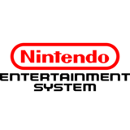 | **Nintendo Entertainment System (NES)** | 1,655 | 1,585 | [Download (.xcollx, 9 MB)](https://github.com/hacan359/tonkatsu-collections/blob/main/games/nes_games.xcollx) |
| | **Sega Master System** | 574 | 531 | [Download (.xcollx, 3 MB)](https://github.com/hacan359/tonkatsu-collections/blob/main/games/master_system_games.xcollx) |
| 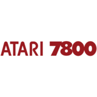 | **Atari 7800** | 98 | 94 | [Download (.xcollx, <1 MB)](https://github.com/hacan359/tonkatsu-collections/blob/main/games/atari_7800_games.xcollx) |

### Generation 4 — 16-bit Era (1987–1996)

| | Platform | Games | Covers | Download |
|:---:|----------|------:|-------:|----------|
| 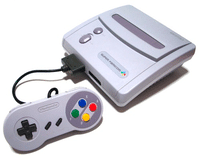 | **Super Nintendo (SNES)** | 1,973 | 1,826 | [Download (.xcollx, 10 MB)](https://github.com/hacan359/tonkatsu-collections/blob/main/games/snes_games.xcollx) |
| | **Sega Genesis / Mega Drive** | 1,643 | 1,488 | [Download (.xcollx, 9 MB)](https://github.com/hacan359/tonkatsu-collections/blob/main/games/genesis_games.xcollx) |
|  | **Game Boy** | 1,469 | 1,412 | [Download (.xcollx, 8 MB)](https://github.com/hacan359/tonkatsu-collections/blob/main/games/gameboy_games.xcollx) |
|  | **Sega Game Gear** | 432 | 408 | [Download (.xcollx, 2 MB)](https://github.com/hacan359/tonkatsu-collections/blob/main/games/game_gear_games.xcollx) |
|  | **TurboGrafx-16 / PC Engine** | 420 | 398 | [Download (.xcollx, 2 MB)](https://github.com/hacan359/tonkatsu-collections/blob/main/games/turbografx_games.xcollx) |
| 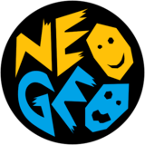 | **Neo Geo AES** | 168 | 168 | [Download (.xcollx, 1 MB)](https://github.com/hacan359/tonkatsu-collections/blob/main/games/neo_geo_games.xcollx) |
| 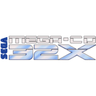 | **Sega 32X** | 60 | 54 | [Download (.xcollx, <1 MB)](https://github.com/hacan359/tonkatsu-collections/blob/main/games/sega_32x_games.xcollx) |
| | **Sega CD** | 252 | 240 | [Download (.xcollx, 1 MB)](https://github.com/hacan359/tonkatsu-collections/blob/main/games/sega_cd_games.xcollx) |

### Generation 5 — 32/64-bit Era (1993–2001)

| | Platform | Games | Covers | Download |
|:---:|----------|------:|-------:|----------|
|  | **PlayStation (PS1)** | 3,789 | 3,643 | [Download (.xcollx, 22 MB)](https://github.com/hacan359/tonkatsu-collections/blob/main/games/ps1_games.xcollx) |
|  | **Nintendo 64** | 1,262 | 1,046 | [Download (.xcollx, 5 MB)](https://github.com/hacan359/tonkatsu-collections/blob/main/games/n64_games.xcollx) |
|  | **Game Boy Color** | 1,408 | 1,353 | [Download (.xcollx, 8 MB)](https://github.com/hacan359/tonkatsu-collections/blob/main/games/gbc_games.xcollx) |
| 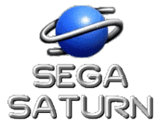 | **Sega Saturn** | 1,053 | 1,030 | [Download (.xcollx, 6 MB)](https://github.com/hacan359/tonkatsu-collections/blob/main/games/saturn_games.xcollx) |
| 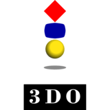 | **3DO Interactive Multiplayer** | 339 | 336 | [Download (.xcollx, 2 MB)](https://github.com/hacan359/tonkatsu-collections/blob/main/games/3do_games.xcollx) |
|  | **Atari Jaguar** | 108 | 105 | [Download (.xcollx, <1 MB)](https://github.com/hacan359/tonkatsu-collections/blob/main/games/atari_jaguar_games.xcollx) |

### Generation 6 — 128-bit Era (1998–2005)

| | Platform | Games | Covers | Download |
|:---:|----------|------:|-------:|----------|
|  | **Game Boy Advance (GBA)** | 2,291 | 2,024 | [Download (.xcollx, 12 MB)](https://github.com/hacan359/tonkatsu-collections/blob/main/games/gba_games.xcollx) |
|  | **Xbox** | 1,180 | 1,162 | [Download (.xcollx, 7 MB)](https://github.com/hacan359/tonkatsu-collections/blob/main/games/xbox_games.xcollx) |
| 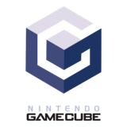 | **Nintendo GameCube** | 925 | 892 | [Download (.xcollx, 5 MB)](https://github.com/hacan359/tonkatsu-collections/blob/main/games/gamecube_games.xcollx) |
| 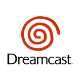 | **Dreamcast** | 718 | 704 | [Download (.xcollx, 4 MB)](https://github.com/hacan359/tonkatsu-collections/blob/main/games/dreamcast_games.xcollx) |

### Generation 7 — HD Era (2004–2013)

| | Platform | Games | Covers | Download |
|:---:|----------|------:|-------:|----------|
|  | **PlayStation Portable (PSP)** | 3,008 | 2,971 | [Download (.xcollx, 18 MB)](https://github.com/hacan359/tonkatsu-collections/blob/main/games/psp_games.xcollx) |

---

## Top 50 Curated Collections

Hand-picked best games by user rating — 50 top-rated titles per platform.

| Collection | Platform | Download |
|-----------|----------|----------|
| Top SNES Games | Super Nintendo | [Download (.xcollx)](https://github.com/hacan359/tonkatsu-collections/blob/main/games/top_snes_games.xcollx) |
| Top PS1 Games | PlayStation | [Download (.xcollx)](https://github.com/hacan359/tonkatsu-collections/blob/main/games/top_ps1_games.xcollx) |
| Top NES Games | Nintendo (NES) | [Download (.xcollx)](https://github.com/hacan359/tonkatsu-collections/blob/main/games/top_nes_games.xcollx) |
| Top Genesis Games | Sega Genesis | [Download (.xcollx)](https://github.com/hacan359/tonkatsu-collections/blob/main/games/top_genesis_games.xcollx) |
| Top N64 Games | Nintendo 64 | [Download (.xcollx)](https://github.com/hacan359/tonkatsu-collections/blob/main/games/top_n64_games.xcollx) |
| Top Game Boy Games | Game Boy | [Download (.xcollx)](https://github.com/hacan359/tonkatsu-collections/blob/main/games/top_gameboy_games.xcollx) |
| Top GBA Games | Game Boy Advance | [Download (.xcollx)](https://github.com/hacan359/tonkatsu-collections/blob/main/games/top_gba_games.xcollx) |
| Top GameCube Games | GameCube | [Download (.xcollx)](https://github.com/hacan359/tonkatsu-collections/blob/main/games/top_gamecube_games.xcollx) |
| Top PS2 Games | PlayStation 2 | [Download (.xcollx)](https://github.com/hacan359/tonkatsu-collections/blob/main/games/top_ps2_games.xcollx) |
| Top Xbox Games | Xbox | [Download (.xcollx)](https://github.com/hacan359/tonkatsu-collections/blob/main/games/top_xbox_games.xcollx) |
| Top Wii Games | Nintendo Wii | [Download (.xcollx)](https://github.com/hacan359/tonkatsu-collections/blob/main/games/top_wii_games.xcollx) |
| Top PS3 Games | PlayStation 3 | [Download (.xcollx)](https://github.com/hacan359/tonkatsu-collections/blob/main/games/top_ps3_games.xcollx) |
| Top Xbox 360 Games | Xbox 360 | [Download (.xcollx)](https://github.com/hacan359/tonkatsu-collections/blob/main/games/top_xbox360_games.xcollx) |
| Top PS4 Games | PlayStation 4 | [Download (.xcollx)](https://github.com/hacan359/tonkatsu-collections/blob/main/games/top_ps4_games.xcollx) |
| Top Xbox One Games | Xbox One | [Download (.xcollx)](https://github.com/hacan359/tonkatsu-collections/blob/main/games/top_xboxone_games.xcollx) |
| Top Switch Games | Nintendo Switch | [Download (.xcollx)](https://github.com/hacan359/tonkatsu-collections/blob/main/games/top_switch_games.xcollx) |
| Top PS5 Games | PlayStation 5 | [Download (.xcollx)](https://github.com/hacan359/tonkatsu-collections/blob/main/games/top_ps5_games.xcollx) |
| Top PC Games | PC (Windows) | [Download (.xcollx)](https://github.com/hacan359/tonkatsu-collections/blob/main/games/top_pc_games.xcollx) |

---

## Movies, TV Shows & Anime

Top rated collections from [TMDB](https://www.themoviedb.org/) — 50 titles each.

| Collection | Type | Download |
|-----------|------|----------|
| Top Rated Movies | Movies | [Download (.xcollx)](https://github.com/hacan359/tonkatsu-collections/blob/main/movies/top_rated_movies.xcollx) |
| Top Rated TV Shows | TV Shows | [Download (.xcollx)](https://github.com/hacan359/tonkatsu-collections/blob/main/tv-shows/top_rated_tv_shows.xcollx) |
| Best Anime Series | Animated Series | [Download (.xcollx)](https://github.com/hacan359/tonkatsu-collections/blob/main/anime/best_anime_series.xcollx) |
| Best Anime Movies | Animated Movies | [Download (.xcollx)](https://github.com/hacan359/tonkatsu-collections/blob/main/anime/best_anime_movies.xcollx) |

---

## What is Tonkatsu Box?

[**Tonkatsu Box**](https://github.com/hacan359/tonkatsu_box) is a free, open-source app for managing your retro game collection, movie library, TV show watchlist, and anime backlog — all in one place. Available for **Windows** and **Android**.

### Key features:
- **Board view** — drag-and-drop visual canvas for organizing collections
- **Offline-first** — all data stored locally, no account required
- **Multi-platform** — track games, movies, TV shows, and anime
- **Import/Export** — share collections as `.xcollx` files
- **Rich metadata** — covers, descriptions, ratings, genres from IGDB & TMDB

### Browse your collections

Import any library and instantly get a visual grid of every game with covers, titles, and progress tracking.

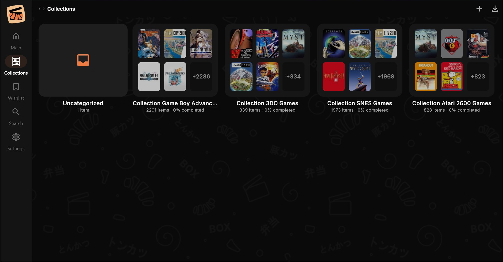

### Search across all data

Find any game across all imported collections — filter by platform, sort by rating, and jump straight to the title you need.

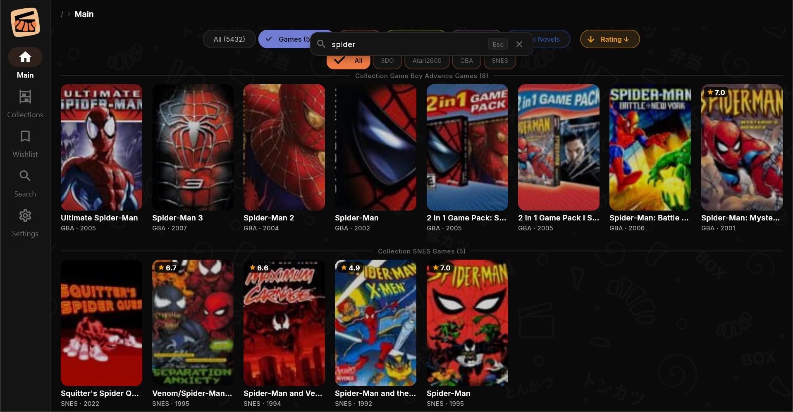

## How to Import Collections

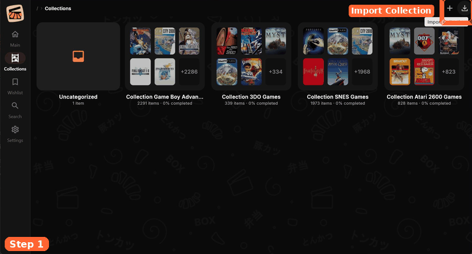

1. Download any `.xcollx` file from the tables above
2. Open **Tonkatsu Box** and go to **Collections** tab
3. Click **Import** and select the downloaded file
4. Done — your collection is ready with covers and metadata

## File Format

**`.xcollx`** — full collection with embedded cover images (base64). Works fully offline after import. Contains game metadata: name, description, cover, rating, genres, release date, and platform info. Size ranges from <1 MB (Sega 32X, 60 games) to 22 MB (PlayStation, 3,789 games).

## Contributing

Want to add a new platform or collection? Open a [Pull Request](https://github.com/hacan359/tonkatsu-collections/pulls) or [Issue](https://github.com/hacan359/tonkatsu-collections/issues). You can also export your own collections from Tonkatsu Box and share them here.

## Get Tonkatsu Box

- [GitHub Repository](https://github.com/hacan359/tonkatsu_box)
- [Website](https://hacan359.github.io/tonkatsu_box/)
- [Download Latest Release](https://github.com/hacan359/tonkatsu_box/releases/latest)

---

*Game data and platform logos sourced from [IGDB](https://www.igdb.com/). Movie and TV data from [TMDB](https://www.themoviedb.org/). Collections auto-generated — see the [tool scripts](https://github.com/hacan359/tonkatsu_box/tree/main/tool) for details.*

*Keywords: retro game database, complete game list, NES game list, SNES complete library, PlayStation PS1 all games, Sega Genesis game catalog, Game Boy games database, Nintendo 64 full library, Dreamcast games, Game Boy Advance complete list, Sega Saturn games, Neo Geo game collection, Atari 2600 games, PSP game library, GameCube all games, Xbox original games, retro gaming catalog, offline game database, game collection manager, IGDB game data*
