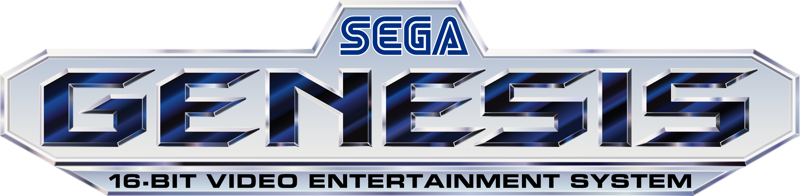
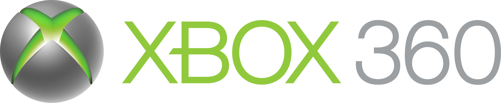
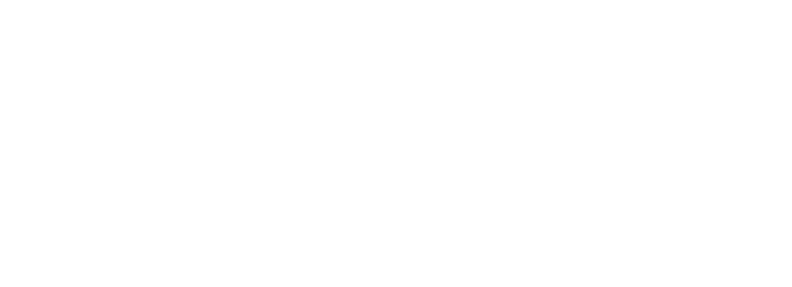
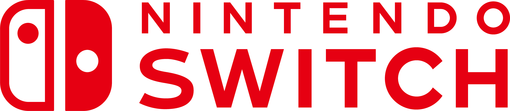

# Tonkatsu Collections

Pre-built collections for [**Tonkatsu Box**](https://github.com/hacan359/tonkatsu_box) — the free, open-source media collection manager for Windows & Android.

<p align="center">
  <a href="#complete-game-libraries-by-platform"></a>
  <a href="#complete-game-libraries-by-platform"></a>
  <a href="#console-exclusives"></a>
  <a href="#movies-tv-shows--animation"></a>
  <a href="https://github.com/hacan359/tonkatsu_box/releases/latest"></a>
</p>

---

## What's inside

| Collection type | What it is |
|---|---|
| **Complete** | The full catalogue of games released for a platform. |
| **Top 50** | Hand-picked highlights — the must-play 50 per platform. |
| **Exclusives** | Games released *only* on that platform — sourced from Wikipedia + verified via IGDB. |

All collections use Tonkatsu Box's native [`.xcoll`/`.xcollx`](#file-format-xcoll--xcollx) format.

---

## How to use

### In Tonkatsu Box (recommended)

> Requires **Tonkatsu Box v0.25+**

1. Open Tonkatsu Box
2. Go to **Settings → Import → Browse Online Collections**
3. Pick a collection and tap *Download*

### Manual import

1. Download any `.xcoll` / `.xcollx` file from the tables below.
2. In Tonkatsu Box: **Import → Import Collection**.
3. Select the file — done.

---

## Complete game libraries by platform

### Generation 2 — Early home consoles (1976–1983)

| | Platform | Complete | Top 50 | Exclusives |
|:---:|---|:---:|:---:|:---:|
|  | **Atari 2600** | [828](platforms/atari-2600/complete.xcollx) | — | [143](platforms/atari-2600/exclusives.xcoll) |

### Generation 3 — 8-bit era (1983–1992)

| | Platform | Complete | Top 50 | Exclusives |
|:---:|---|:---:|:---:|:---:|
|  | **Nintendo Entertainment System** | [1,705](platforms/nes/complete.xcollx) | [50](platforms/nes/top.xcollx) | [328](platforms/nes/exclusives.xcoll) |
|  | **Sega Master System** | [574](platforms/master-system/complete.xcollx) | — | [51](platforms/master-system/exclusives.xcoll) |
|  | **Atari 7800** | [98](platforms/atari-7800/complete.xcollx) | — | [6](platforms/atari-7800/exclusives.xcoll) |

### Generation 4 — 16-bit era (1987–1996)

| | Platform | Complete | Top 50 | Exclusives |
|:---:|---|:---:|:---:|:---:|
|  | **Super Nintendo Entertainment System** | [2,023](platforms/snes/complete.xcollx) | [50](platforms/snes/top.xcollx) | [338](platforms/snes/exclusives.xcoll) |
|  | **Sega Genesis / Mega Drive** | [1,693](platforms/genesis/complete.xcollx) | [50](platforms/genesis/top.xcollx) | [156](platforms/genesis/exclusives.xcoll) |
|  | **Game Boy** | [1,519](platforms/gb/complete.xcollx) | [50](platforms/gb/top.xcollx) | [132](platforms/gb/exclusives.xcoll) |
|  | **Sega Game Gear** | [432](platforms/game-gear/complete.xcollx) | — | [38](platforms/game-gear/exclusives.xcoll) |
|  | **TurboGrafx-16 / PC Engine** | [420](platforms/turbografx/complete.xcollx) | — | [30](platforms/turbografx/exclusives.xcoll) |
|  | **Neo Geo AES** | [168](platforms/neo-geo/complete.xcollx) | — | — |
|  | **Sega 32X** | [60](platforms/sega-32x/complete.xcollx) | — | [12](platforms/sega-32x/exclusives.xcoll) |
|  | **Sega CD / Mega-CD** | [252](platforms/sega-cd/complete.xcollx) | — | [36](platforms/sega-cd/exclusives.xcoll) |

### Generation 5 — 32/64-bit era (1993–2001)

| | Platform | Complete | Top 50 | Exclusives |
|:---:|---|:---:|:---:|:---:|
|  | **PlayStation** | [3,839](platforms/ps1/complete.xcollx) | [50](platforms/ps1/top.xcollx) | [457](platforms/ps1/exclusives.xcoll) |
|  | **Nintendo 64** | [1,312](platforms/n64/complete.xcollx) | [50](platforms/n64/top.xcollx) | [123](platforms/n64/exclusives.xcoll) |
|  | **Game Boy Color** | [1,408](platforms/gbc/complete.xcollx) | — | [157](platforms/gbc/exclusives.xcoll) |
|  | **Sega Saturn** | [1,053](platforms/saturn/complete.xcollx) | — | [66](platforms/saturn/exclusives.xcoll) |
|  | **3DO** | [339](platforms/3do/complete.xcollx) | — | [31](platforms/3do/exclusives.xcoll) |
|  | **Atari Jaguar** | [108](platforms/atari-jaguar/complete.xcollx) | — | [28](platforms/atari-jaguar/exclusives.xcoll) |

### Generation 6 — 128-bit era (1998–2005)

| | Platform | Complete | Top 50 | Exclusives |
|:---:|---|:---:|:---:|:---:|
|  | **Game Boy Advance** | [2,341](platforms/gba/complete.xcollx) | [50](platforms/gba/top.xcollx) | [290](platforms/gba/exclusives.xcoll) |
|  | **Xbox** | [1,230](platforms/xbox/complete.xcollx) | [50](platforms/xbox/top.xcollx) | [107](platforms/xbox/exclusives.xcoll) |
|  | **Nintendo GameCube** | [975](platforms/gamecube/complete.xcollx) | [50](platforms/gamecube/top.xcollx) | [88](platforms/gamecube/exclusives.xcoll) |
|  | **Sega Dreamcast** | [718](platforms/dreamcast/complete.xcollx) | — | [119](platforms/dreamcast/exclusives.xcoll) |
|  | **PlayStation 2** | — | [50](platforms/ps2/top.xcollx) | [545](platforms/ps2/exclusives.xcoll) |

### Generation 7 — HD era (2004–2013)

| | Platform | Complete | Top 50 | Exclusives |
|:---:|---|:---:|:---:|:---:|
|  | **PlayStation Portable** | [3,008](platforms/psp/complete.xcollx) | — | [250](platforms/psp/exclusives.xcoll) |
|  | **Nintendo Wii** | — | [50](platforms/wii/top.xcollx) | [323](platforms/wii/exclusives.xcoll) |
|  | **Xbox 360** | — | [50](platforms/xbox-360/top.xcollx) | [217](platforms/xbox-360/exclusives.xcoll) |
|  | **PlayStation 3** | — | [50](platforms/ps3/top.xcollx) | [169](platforms/ps3/exclusives.xcoll) |

### Generation 8+ — Modern era (2013+)

| | Platform | Complete | Top 50 | Exclusives |
|:---:|---|:---:|:---:|:---:|
|  | **PlayStation 4** | — | [50](platforms/ps4/top.xcollx) | [48](platforms/ps4/exclusives.xcoll) |
|  | **PlayStation 5** | — | [50](platforms/ps5/top.xcollx) | [23](platforms/ps5/exclusives.xcoll) |
|  | **Xbox One** | — | [50](platforms/xbox-one/top.xcollx) | [16](platforms/xbox-one/exclusives.xcoll) |
|  | **Nintendo Switch** | — | [50](platforms/switch/top.xcollx) | [182](platforms/switch/exclusives.xcoll) |

### PC

| | Platform | Complete | Top 50 | Exclusives |
|:---:|---|:---:|:---:|:---:|
|  | **PC (Windows)** | — | [50](platforms/pc/top.xcollx) | — |

---

## Console exclusives

The **Exclusives** collections cover games released *only* on a given platform. Built by cross-referencing Wikipedia's `X-only games` categories with IGDB:

1. Pull category members from Wikipedia.
2. Look up Wikidata QID → IGDB game slug (property `P5794`).
3. Resolve to IGDB numeric ID, verify the platform tag.
4. Fall back to IGDB name search for entries missing Wikidata bindings.
5. Treat regional sister platforms as equivalent (NES + Famicom, SNES + Super Famicom + Satellaview, Atari Jaguar + Jaguar CD, TurboGrafx-16 + PC Engine SuperGrafx).

Build pipeline lives in [`scripts/build_exclusives.py`](scripts/build_exclusives.py).

---

## Movies, TV shows & animation

| Collection | Type | Items | File |
|---|---|---:|---|
| Best Anime Movies | Animation | 50 | [`best-anime-movies.xcollx`](media/animation/best-anime-movies.xcollx) |
| Best Anime Series | Animation | 49 | [`best-anime-series.xcollx`](media/animation/best-anime-series.xcollx) |
| Top Rated Movies | Movies | 50 | [`top-rated-movies.xcollx`](media/movies/top-rated-movies.xcollx) |
| Top Rated TV Shows | TV Shows | 50 | [`top-rated-tv-shows.xcollx`](media/tv-shows/top-rated-tv-shows.xcollx) |

---

## Repository structure

```
tonkatsu-collections/
├── platforms/              # Game collections by platform
│   └── <slug>/
│       ├── _platform.json      # Platform metadata
│       ├── complete.xcollx     # Full game library (where available)
│       ├── top.xcollx          # Top 50 picks (where available)
│       └── exclusives.xcoll    # Platform-exclusive games
├── media/                  # Movies, TV shows, animation
├── curated/                # Cross-platform hand-curated lists
├── scripts/                # build_index, validate_xcoll, build_exclusives
├── index.json              # Auto-generated collection index
└── .github/workflows/      # CI: build index, validate PRs
```

---

## File format (`.xcoll` / `.xcollx`)

Collections use Tonkatsu Box's native [export format](https://github.com/hacan359/tonkatsu_box/blob/main/docs/RCOLL_FORMAT.md).

- **`.xcoll`** — light export (IDs only, small files, metadata fetched on import).
- **`.xcollx`** — full export (includes board layout, embedded covers, offline import).

```json
{
  "version": 2,
  "format": "light",
  "name": "Best SNES RPGs",
  "author": "hacan359",
  "created": "2026-04-03T12:00:00Z",
  "description": "Must-play RPGs for Super Nintendo",
  "items": [
    { "media_type": "game", "external_id": 1234, "platform_id": 19 },
    { "media_type": "game", "external_id": 5678, "platform_id": 19 }
  ]
}
```

---

## Contributing

Got a collection to share? See [CONTRIBUTING.md](CONTRIBUTING.md) for guidelines. CI validates every PR automatically.

## Get Tonkatsu Box

- [GitHub Repository](https://github.com/hacan359/tonkatsu_box)
- [Download latest release](https://github.com/hacan359/tonkatsu_box/releases/latest)

---

<sub>Game data from [IGDB](https://www.igdb.com/). Movie and TV data from [TMDB](https://www.themoviedb.org/). Exclusives sourced from Wikipedia categories.</sub>
